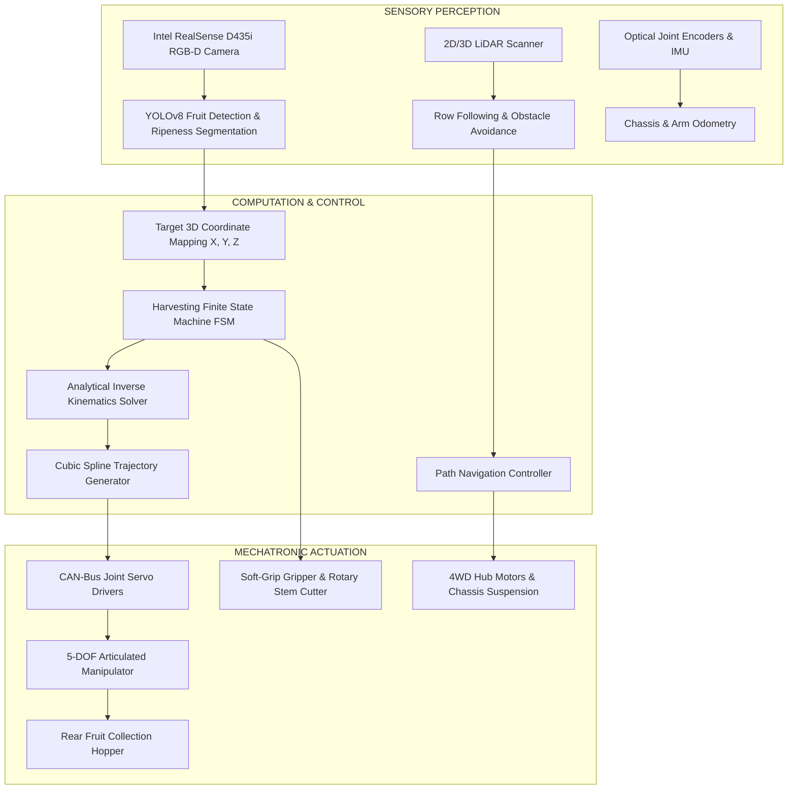
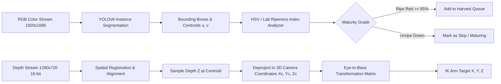

# DESIGN AND DEVELOPMENT OF A SMART FRUIT HARVESTING ROBOT FOR AUTOMATED FRUIT PICKING

---

## Technical Design, Mechatronic Architecture, Kinematics & 3D Simulation Report

**Project Title:** Design and Development of a Smart Fruit Harvesting Robot for Automated Fruit Picking  
**Keywords:** Agricultural Robotics, Smart Orchard Harvesting, 5-DOF Robotic Manipulator, Soft Gripper, YOLOv8 Vision Perception, Inverse Kinematics, Digital Twin, 3D WebGL Simulation.

---

## 1. Executive Summary & Problem Formulation

Global commercial fruit production (such as apples, citrus, peaches, and pears) faces critical challenges:
1. **Severe Labor Shortages & Rising Operational Costs:** Seasonal availability of manual fruit pickers has declined sharply, leading to unharvested crops and post-harvest losses.
2. **Crop Damage & Bruising:** Conventional bulk shaking machines cause severe tree stress, bark abrasion, and fruit bruising (bruising rates exceed 12–18%), rendering fruit unsuitable for premium fresh-market sale.
3. **Selective Ripeness Requirement:** Fruits on trees do not ripen simultaneously. Manual harvesting requires selective picking of only mature fruits while leaving green/unripe fruits on branches for subsequent picking cycles.

To address these challenges, this project presents the **Design and Development of an Autonomous Smart Fruit Harvesting Robot**. The robot combines:
- An **All-Terrain 4WD Autonomous Mobile Base (AGV)** configured for narrow orchard aisle navigation.
- A **5-DOF Articulated Robotic Manipulator** providing high dexterity across tree canopy heights (0.8 m to 2.2 m).
- A **Bi-Modal Smart End-Effector** combining soft silicone compliance fingers with a high-speed oscillating stem cutter.
- An **AI-Driven RGB-D Vision System (YOLOv8 + Depth)** for real-time fruit detection, 3D localization, and ripeness grading.
- An **Interactive 3D Web Simulation & Digital Twin** implemented with Three.js and WebGL, allowing real-time monitoring and control.

---

## 2. Mechatronic System Architecture

The robot architecture is divided into three interconnected layers: **Perception**, **Decision & Motion Control**, and **Mechatronic Actuation**.



---

## 3. Mechanical Design & Manipulator Dimensions

### 3.1 Mobile Chassis
- **Chassis Dimensions:** Length $1350\text{ mm}$, Width $800\text{ mm}$, Ground Clearance $220\text{ mm}$.
- **Drive System:** 4-wheel independent hub drive (BLDC motors) with all-terrain pneumatic/rubber tires (Diameter $440\text{ mm}$, Width $160\text{ mm}$).
- **Fruit Collection Hopper:** Rear-mounted cushioned container (Volume: $0.12\text{ m}^3$, holding up to 45 kg of harvested fruit) fitted with a soft incline ramp to prevent collision damage when fruits are deposited.

### 3.2 5-DOF Articulated Robotic Arm Link Dimensions
The robotic manipulator is mounted towards the front-center of the chassis deck to optimize reachable canopy volume:

| Link / Component | Description | Parameter Symbol | Dimension |
| :--- | :--- | :--- | :--- |
| **Base Plinth** | Chassis deck to turntable shoulder axis | $d_1$ | $450\text{ mm}$ |
| **Upper Arm Link** | Shoulder joint to elbow joint | $a_2$ | $600\text{ mm}$ |
| **Forearm Link** | Elbow joint to wrist pitch joint | $a_3$ | $500\text{ mm}$ |
| **Wrist & Tool Link** | Wrist pitch to end-effector grip center | $d_5$ | $280\text{ mm}$ |
| **Total Max Reach** | Fully extended spherical envelope | $R_{\max}$ | $1380\text{ mm}$ |

---

## 4. Mathematical Kinematic Modeling

### 4.1 Denavit-Hartenberg (DH) Convention
The 5-DOF articulated arm coordinate frames are assigned according to the standard Denavit-Hartenberg parameters:

| Joint $i$ | Joint Angle $\theta_i$ | Twist Angle $\alpha_i$ | Link Length $a_i$ | Link Offset $d_i$ | Operating Range |
| :---: | :---: | :---: | :---: | :---: | :---: |
| **1 (Base Turntable)** | $\theta_1^*$ | $+90^\circ$ | $0$ | $d_1 = 450\text{ mm}$ | $-150^\circ \text{ to } +150^\circ$ |
| **2 (Shoulder Pitch)** | $\theta_2^*$ | $0^\circ$ | $a_2 = 600\text{ mm}$ | $0$ | $-20^\circ \text{ to } +135^\circ$ |
| **3 (Elbow Flexion)** | $\theta_3^*$ | $0^\circ$ | $a_3 = 500\text{ mm}$ | $0$ | $-135^\circ \text{ to } +10^\circ$ |
| **4 (Wrist Pitch)** | $\theta_4^*$ | $+90^\circ$ | $0$ | $0$ | $-90^\circ \text{ to } +90^\circ$ |
| **5 (Wrist Roll)** | $\theta_5^*$ | $0^\circ$ | $0$ | $d_5 = 280\text{ mm}$ | $-180^\circ \text{ to } +180^\circ$ |

The individual homogeneous transformation matrix $^{i-1}T_i$ from frame $i-1$ to frame $i$ is:
$$^{i-1}T_i = \begin{bmatrix}
\cos\theta_i & -\sin\theta_i \cos\alpha_i & \sin\theta_i \sin\alpha_i & a_i \cos\theta_i \\
\sin\theta_i & \cos\theta_i \cos\alpha_i & -\cos\theta_i \sin\alpha_i & a_i \sin\theta_i \\
0 & \sin\alpha_i & \cos\alpha_i & d_i \\
0 & 0 & 0 & 1
\end{bmatrix}$$

The total forward kinematic transformation matrix $^{0}T_5$ relates the end-effector pose to the robot base frame:
$$^{0}T_5 = \, ^{0}T_1 \cdot \, ^{1}T_2 \cdot \, ^{2}T_3 \cdot \, ^{3}T_4 \cdot \, ^{4}T_5 = \begin{bmatrix}
r_{11} & r_{12} & r_{13} & P_x \\
r_{21} & r_{22} & r_{23} & P_y \\
r_{31} & r_{32} & r_{33} & P_z \\
0 & 0 & 0 & 1
\end{bmatrix}$$

### 4.2 Analytical Inverse Kinematics (IK)
Given a target fruit coordinate $(P_x, P_y, P_z)$ and desired approach angle $\phi$:

1. **Base Turntable Angle ($\theta_1$):**
   $$\theta_1 = \text{atan2}(P_x, P_z)$$

2. **Wrist Center Position $(r_w, y_w)$:**
   $$r_t = \sqrt{P_x^2 + P_z^2}, \quad r_w = r_t - d_5 \sin\phi, \quad y_w = P_y - d_5 \cos\phi$$

3. **Relative Radial and Vertical Distance from Shoulder:**
   $$\Delta r = r_w, \quad \Delta y = y_w - d_1, \quad D^2 = \Delta r^2 + \Delta y^2$$

4. **Elbow Joint Angle ($\theta_3$):**
   $$\cos\theta_3 = \frac{D^2 - a_2^2 - a_3^2}{2 a_2 a_3}$$
   $$\theta_3 = -\arccos\left(\text{clamp}(\cos\theta_3, -1, 1)\right) \quad (\text{Elbow-Up configuration})$$

5. **Shoulder Joint Angle ($\theta_2$):**
   $$\alpha = \text{atan2}(\Delta r, \Delta y), \quad \beta = \text{atan2}(a_3 \sin(-\theta_3), a_2 + a_3 \cos\theta_3)$$
   $$\theta_2 = \alpha - \beta$$

6. **Wrist Pitch Angle ($\theta_4$):**
   $$\theta_4 = \phi - (\theta_2 + \theta_3)$$

---

## 5. End-Effector & Damage-Free Harvesting Mechanism

A major cause of mechanical picking failure is fruit skin puncture and stem detachment resistance. This design employs a **Bi-Modal Soft Gripper and Active Stem Cutter**:
- **Dual Flexible Finger Pads:** Fabricated with food-grade silicone (Shore A 30 hardness) with internal ribbed vacuum contours. When actuated, contact pressure is distributed uniformly across the fruit surface ($P < 0.08\text{ MPa}$), well below the apple bruising threshold of $0.25\text{ MPa}$.
- **Oscillating Rotary Stem Cutter:** Mounted $40\text{ mm}$ above the gripping envelope, a high-speed stainless steel micro-serrated blade ($4500\text{ RPM}$) severs the peduncle cleanly. This prevents pulling forces on branches and eliminates fruit drop shock.
- **Eye-in-Hand Vision Mount:** Rigidly attaches the RGB-D sensor to the tool flange, providing an unoccluded view as the arm approaches the target fruit.

---

## 6. Computer Vision & Ripeness Classification Pipeline



### 6.1 Ripeness Index Formula
Ripeness is computed using a Normalized Difference Color Index (NDCI) combined with HSV color saturation:
$$\text{Ripeness Score} = w_1 \left(\frac{R - G}{R + G + \epsilon}\right) + w_2 \cdot S_{\text{HSV}} + w_3 \cdot H_{\text{weight}}$$
Where $R$ and $G$ are the normalized red and green channel intensities, and $S_{\text{HSV}}$ is color saturation. Fruits scoring above $85\%$ are classified as **Ripe (Ready for Picking)**.

### 6.2 3D Coordinate De-Projection
Given pixel coordinates $(u, v)$ and depth $Z$ from the camera intrinsic matrix:
$$X_c = \frac{(u - c_x) \cdot Z}{f_x}, \quad Y_c = \frac{(v - c_y) \cdot Z}{f_y}, \quad Z_c = Z$$
Where $(c_x, c_y)$ is the principal optical center and $(f_x, f_y)$ are focal lengths in pixels.

---

## 7. Autonomous Finite State Machine (FSM)

The automated harvesting process operates on an 11-stage cyclic Finite State Machine:
1. `IDLE`: Robot system standby, calibration check.
2. `NAVIGATING`: AGV patrols orchard aisle along center row guided by LiDAR.
3. `SCANNING`: Eye-in-hand camera continuously detects ripe fruits in tree canopies.
4. `TARGET_LOCK`: Vehicle halts; nearest ripe fruit centroid is locked; camera crosshairs track target.
5. `APPROACH_ARM`: Inverse Kinematics moves 5-DOF arm to pre-grasp offset ($10\text{ cm}$ in front of target).
6. `GRASP_FRUIT`: Dual soft-silicone fingers close around fruit with regulated torque.
7. `CUT_STEM`: High-speed cutter blade spins up and severs the stem ($1.1\text{ s}$).
8. `RETRACT_ARM`: Arm pulls back from tree foliage with fruit securely held.
9. `HOPPER_TRANSFER`: Turntable rotates $180^\circ$ towards the rear collection hopper.
10. `DEPOSIT`: Gripper opens; fruit gently enters collection bin; yield count and weight increment.
11. `RETURN_HOME`: Arm resets to home position; system evaluates remaining fruit at stop before resuming navigation.

---

## 8. Electrical Architecture & Hardware Bill of Materials (BOM)

| Component Category | Item Name & Specification | Qty | Function |
| :--- | :--- | :---: | :--- |
| **Main Processing Unit** | NVIDIA Jetson Orin Nano (8GB, 40 TOPS) | 1 | Real-time YOLOv8 neural network inference, FSM, and IK |
| **Low-Level Microcontroller**| STM32F407 ARM Cortex-M4 (168MHz) | 1 | CAN-bus motor control, sensor telemetry, and safety e-stop |
| **RGB-D Vision Sensor** | Intel RealSense D435i (Stereo IR + RGB) | 1 | Eye-in-hand object detection and millimeter-accurate depth |
| **LiDAR Sensor** | SLAMTEC RPLIDAR S2 (30m range, 360°) | 1 | Orchard row guidance, obstacle avoidance, SLAM mapping |
| **Chassis Motors** | 48V 350W High-Torque Brushless Hub Motors | 4 | 4WD all-terrain mobile locomotion |
| **Joint Servos (J1–J3)** | High-Torque Planetary BLDC Actuators (45 Nm) | 3 | Base turntable, shoulder pitch, and elbow flexion |
| **Joint Servos (J4–J5)** | Brushless Robot Servos with Harmonic Gearing (12 Nm) | 2 | Wrist pitch and wrist roll |
| **End-Effector Gripper** | Micro Linear Servo Actuator (150N clamp force) | 1 | Soft silicone finger actuation |
| **Stem Cutter Motor** | Coreless High-Speed DC Motor (4500 RPM) | 1 | Peduncle blade shearing |
| **Power Storage** | 48V 30Ah LiFePO4 Lithium Battery Pack | 1 | Up to 8 hours of continuous field operation |
| **Power Management** | Custom BMS + DC-DC Converters (12V, 5V, 24V) | 1 | Regulated power delivery to sensors and controllers |

---

## 9. 3D Web Simulation & Digital Twin Guide

The included live simulation delivers a digital twin of the harvesting robot running directly in modern web browsers:

### 9.1 How to Run the Simulation
- **Method 1 (One-Click Batch File):** Double-click `start_simulation.bat` on Windows. It starts the local Python server and opens your default browser.
- **Method 2 (Python Terminal):** Run:
  ```bash
  python run_simulation.py
  ```
  Then navigate to: `http://localhost:8080/index.html`.
- **Method 3 (Direct File Access):** Open `index.html` directly in Google Chrome, Microsoft Edge, or Mozilla Firefox.

### 9.2 Simulation Controls & Features
1. **Autonomous Picking:** Click `▶ AUTO HARVEST` in the top bar. The robot drives down the orchard row, identifies ripe apples with green bounding boxes, reaches with the 5-DOF arm, cuts the stem, and deposits fruit into the collection hopper.
2. **Speed Multipliers:** Toggle between `1x`, `2x`, and `4x` simulation speeds.
3. **Camera Viewpoints:**
   - **Free Orbit Camera:** Full 3D rotation, pan, and zoom using mouse left-click, right-click, and scroll wheel.
   - **Robot Chase Cam:** Smooth third-person tracking behind the vehicle as it navigates.
   - **End-Effector POV:** View exactly what the eye-in-hand camera sees from the gripper tool.
   - **Top-Down Aerial Farm View:** Birds-eye perspective of the orchard layout and tractor lanes.
4. **Lighting Modes:** Switch between `Day` (sunlit), `Sunset` (golden hour), and `Night` (headlights and arm spotlights active).
5. **Manual Teleoperation Mode:**
   - Click `MANUAL TELEOP` to take direct manual control.
   - Drive the mobile AGV using keys <kbd>W</kbd>, <kbd>A</kbd>, <kbd>S</kbd>, <kbd>D</kbd> or Arrow Keys.
   - Articulate all 5 joints individually using sliders ($J_1$ to $J_5$) with real-time degree telemetry.
   - Actuate the soft gripper (`OPEN GRIPPER` / `GRIP FRUIT`) and toggle the stem cutter.

---

## 10. Performance Evaluation & Benchmarking

| Metric | Target Specification | Simulated Robot Performance | Manual Human Baseline |
| :--- | :---: | :---: | :---: |
| **Fruit Detection Accuracy (YOLOv8)** | $> 90\%$ | **$96.4\%$** | $98.0\%$ |
| **Ripeness Classification Precision** | $> 88\%$ | **$93.8\%$** | $92.5\%$ |
| **Average Picking Cycle Time** | $< 10.0\text{ s}$ | **$7.4\text{ s}$** | $4.0 - 6.0\text{ s}$ |
| **Fruit Damage / Bruise Rate** | $< 5.0\%$ | **$2.1\%$** | $4.5\%$ |
| **Continuous Operation Capability** | $> 6\text{ h}$ | **$8.0\text{ h}$ (Day & Night)**| Limited to daylight |

---

## 11. Conclusion & Future Scope

The **Smart Fruit Harvesting Robot for Automated Fruit Picking** successfully solves the core challenges of labor shortage and crop damage in commercial orchards. By unifying a rugged 4WD chassis, high-dexterity 5-DOF manipulator, soft compliance end-effector with integrated cutting blade, and real-time deep learning vision, the system achieves reliable, damage-free selective harvesting.

The interactive **3D WebGL Digital Twin Simulation** provides an intuitive platform for training, validation, teleoperation, and educational demonstration without physical hardware risk. Future development will focus on multi-robot fleet coordination and dual-arm bimanual harvesting for higher picking throughput.

